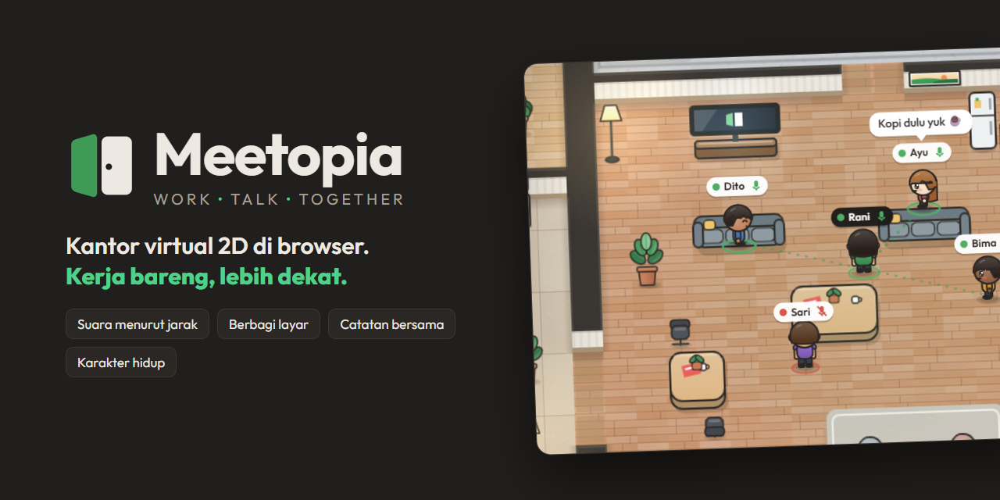
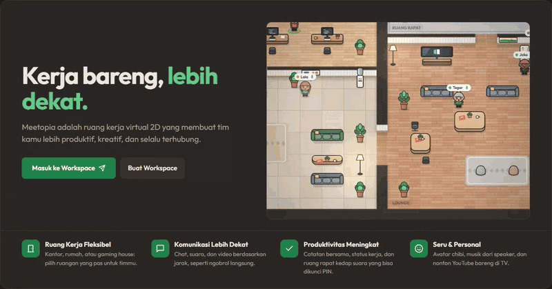
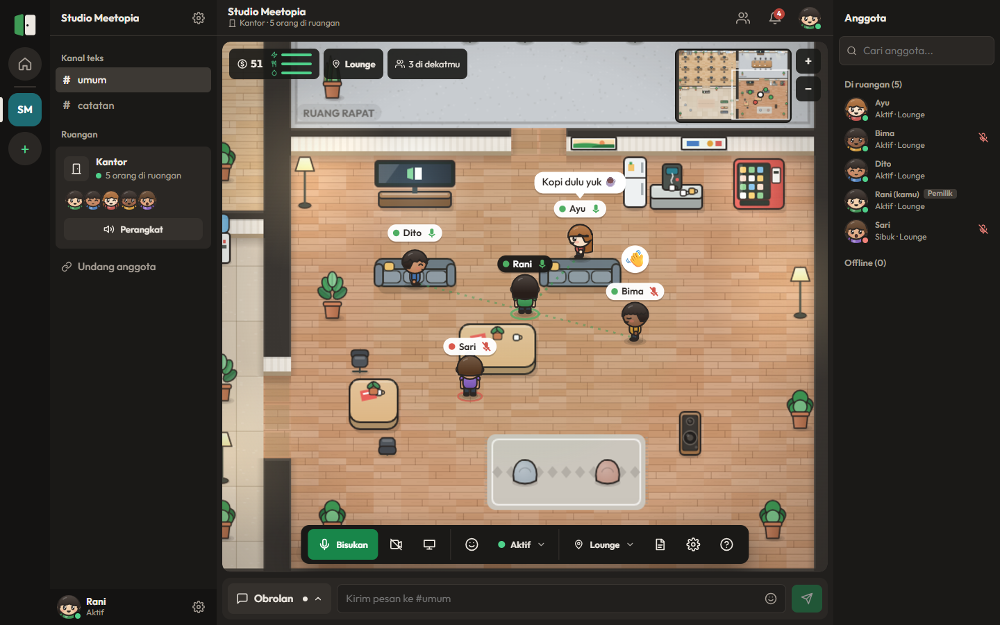
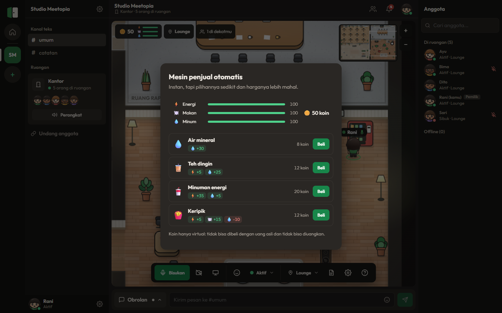
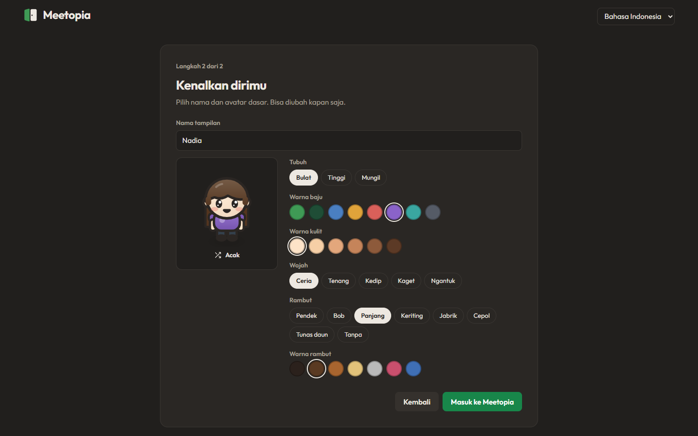
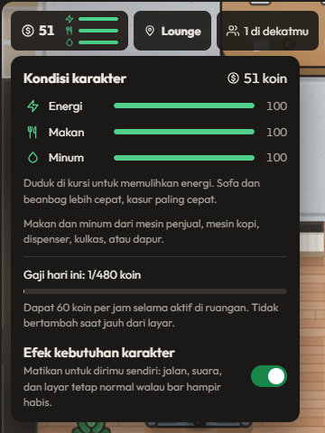
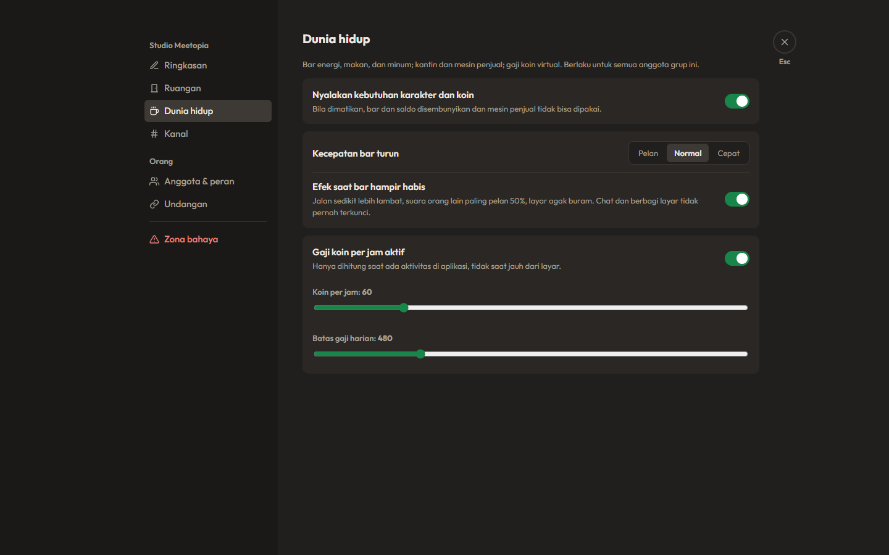

<div align="center">



<h1>
  
  Meetopia
</h1>

**Work • Talk • Together.** Kantor virtual 2D yang jalan langsung di browser.

[**Coba demo**](https://meetopia-two.vercel.app) &nbsp;·&nbsp; [Spesifikasi (PRD)](docs/PRD.md) &nbsp;·&nbsp; [Arah desain](DESIGN.md)




<sub>Pratinjau hidup di halaman awal aplikasi. Versi video: <a href="docs/assets/demo.mp4">demo.mp4</a>.</sub>

</div>

---

Setiap workspace punya ruangan 2D sendiri. Anggotanya hadir sebagai avatar chibi yang bisa berjalan, ngobrol dengan suara yang mengikuti jarak, berbagi layar, nonton YouTube bareng, dan menulis catatan bersama. Kerangkanya terasa seperti Discord: daftar workspace di kiri, kanal chat, dan panel anggota. Bedanya, di tengahnya ada ruangan yang hidup.

Spesifikasi lengkap ada di [`docs/PRD.md`](docs/PRD.md), lengkap dengan centang per milestone. Arah tampilan ada di [`DESIGN.md`](DESIGN.md).

- [Fitur](#fitur)
- [Tangkapan layar](#tangkapan-layar)
- [Mulai cepat](#mulai-cepat)
- [Kontrol](#kontrol)
- [Arsitektur](#arsitektur)
- [Deploy](#deploy)
- [Identitas visual](#identitas-visual)
- [Pengaturan](#pengaturan)
- [Peta jalan](#peta-jalan)

## Fitur

### Ruangan

- **Tiga jenis ruangan**, dipilih saat membuat workspace dan bisa diganti kapan saja di pengaturan workspace:

  | Jenis            | Cocok untuk                    | Kelebihan                                                                                     |
  | ---------------- | ------------------------------ | --------------------------------------------------------------------------------------------- |
  | **Kantor**       | Tim kerja                      | Area kerja dengan meja dan catatan pribadi, ruang rapat kedap suara yang bisa dikunci, lounge |
  | **Rumah**        | Keluarga dan teman dekat       | Ruang keluarga dengan TV dan speaker, dua kamar kedap suara, dapur, meja makan, teras kebun   |
  | **Gaming house** | Main bareng dan komunitas game | Ruang main yang otomatis jadi satu party suara, ruang strategi terkunci, arcade, snack bar    |

- **Kunci ruangan dengan PIN.** Orang pertama yang masuk ruang yang bisa dikunci menjadi pemegang ruangan dan boleh memasang PIN. Orang lain harus memasukkan PIN (atau mengetuk) untuk masuk. Saat pemegang keluar, perannya pindah ke orang lain yang masih di dalam; kalau ruangan kosong, kunci direset. PIN hanya disimpan sebagai hash di server dan tidak pernah dikirim ke klien.
- **Speaker musik dengan jarak.** Putar stasiun bawaan (Lo-fi santai, Ambient fokus, Piano sore, Kafe 8-bit), video YouTube, atau tautan audio https. Suara penuh sampai 2,5 tile, makin pelan saat menjauh, hilang di 12 tile, teredam 35% di balik dinding, dan tidak tembus ke ruang kedap suara. Posisi lagu dihitung dari jam server, jadi semua orang mendengar bagian yang sama.
- **TV untuk nonton YouTube bareng.** Tempel tautan YouTube di TV; semua orang yang menonton mulai dari detik yang sama. Videonya tampil di popup yang bisa diperbesar.
- **Pindah cepat** ke dekat rekan lewat menu "Pergi ke…", tanpa harus berjalan. Rekan yang sedang sibuk atau berada di ruang terkunci tidak bisa didatangi begitu saja.
- **Status rapat otomatis** saat masuk ruang kedap suara, kembali aktif saat keluar.

### Karakter hidup

- **Bar energi, makan, dan minum** yang turun pelan selama online. Duduk di kursi memulihkan energi; sofa dan beanbag lebih cepat, kasur paling cepat.
- **Makan dan minum** dari mesin penjual (instan, lebih mahal), mesin kopi (diseduh sebentar), dispenser dan kulkas (air gratis), atau dapur (menu lengkap dan lebih murah, tapi menunggu). Tiap item punya efek berbeda, dan avatar menampilkan apa yang sedang dinikmati.
- **Gaji koin virtual** untuk setiap menit aktif di ruangan, dengan batas harian. Tidak bertambah saat jauh dari layar. Koin tidak bisa dibeli dengan uang asli dan tidak bisa diuangkan.
- **Efek ringan** saat bar hampir habis: jalan sedikit lebih lambat, suara orang lain sedikit lebih pelan, layar agak buram. Chat dan berbagi layar tidak pernah terkunci, dan efeknya bisa dimatikan oleh admin maupun pengguna.

### Komunikasi

- **Suara menurut jarak** lewat WebRTC: hanya terhubung ke orang di sekitar (maks. 16 audio, 8 video). Ruang privat terisolasi penuh.
- **Volume per orang**, plus volume umum untuk suara orang lain dan musik.
- **Berbagi layar** untuk rekan di dekatmu. Penonton bisa memilih layar penuh, kecil, atau disembunyikan; presenter melihat pratinjau layarnya sendiri.
- **Chat** per kanal dan pesan "Sekitar" yang muncul sebagai balon di atas kepala, dengan pemilih emoji. Emote cepat (lambai, rayakan) juga tampil di atas avatar.
- **Ketuk** untuk minta masuk ke ruangan orang lain, lengkap dengan bunyi dan notifikasi browser.
- **Lonceng notifikasi** di header untuk ketukan, pesan langsung, dan sebutan.

### Kolaborasi

- **Catatan bergaya Notion**: dokumen berbasis blok dengan paragraf, tiga level judul, ceklis, daftar berpoin dan bernomor, kutipan, callout, kode, dan garis pemisah. Pintasan ala markdown di awal baris (`# `, `[] `, `- `, `1. `, `> `, `! `, ` ``` `, `---`). Ceklis menampilkan progres, dan catatan bisa dibuka lebar.
- Catatan pribadi di meja kerja dan catatan bersama di papan tulis. Catatan lama berupa teks biasa otomatis diubah menjadi blok.
- **Anggota**: cari anggota, lihat siapa yang sedang online dan kapan terakhir aktif.

### Workspace dan undangan

- **Beranda** untuk memilih workspace, membuat yang baru, atau bergabung dengan kode.
- **Undangan** lewat tautan atau kode 6 karakter (`/invite/KODE`).
- **Ikon workspace** berupa warna dan simbol, plus deskripsi.
- **Kanal** bisa dibuat, diganti nama, dan dihapus.
- **Peran dan kepemilikan**: atur peran anggota, serahkan kepemilikan, atau hapus workspace.

### Personalisasi

- **Avatar chibi** yang bisa diatur (warna kulit, bentuk badan, wajah, gaya dan warna rambut, warna baju), dengan animasi jalan, napas, dan kedip dari depan, samping, dan belakang.
- **Status khusus** dengan teks dan waktu kedaluwarsa, plus **kartu profil** saat mengklik seseorang.
- **Tema** gelap, terang, atau ikuti sistem, dengan pilihan kontras tinggi dan kurangi gerakan.
- **Dua bahasa**: Indonesia dan Inggris.

## Tangkapan layar

<table>
  <tr>
    <td colspan="2"><br><sub><b>Ruangan.</b> Lima orang di lounge. Garis putus-putus menunjukkan siapa yang bisa saling mendengar.</sub></td>
  </tr>
  <tr>
    <td width="50%"><br><sub><b>Mesin penjual.</b> Tiap item punya efek berbeda; harga dan saldo dicek di server.</sub></td>
    <td width="50%"><br><sub><b>Pembuat avatar.</b> Langsung bisa masuk tanpa membeli apa pun.</sub></td>
  </tr>
  <tr>
    <td width="50%"><br><sub><b>Kondisi karakter.</b> Bar kebutuhan, gaji hari ini, dan sakelar efek.</sub></td>
    <td width="50%"><br><sub><b>Pengaturan admin.</b> Semua mekanik bisa dimatikan atau diatur per workspace.</sub></td>
  </tr>
</table>

## Mulai cepat

Butuh Node.js 20 atau lebih baru. Database dan Redis tidak wajib untuk mencoba.

```bash
git clone https://github.com/ihyaabrar/meetopia.git
cd meetopia
npm install
npm run dev          # http://localhost:3000
```

Tanpa variabel lingkungan apa pun:

- Data disimpan di PostgreSQL lokal dalam proses (PGlite) di folder `.data/`.
- Kehadiran dan pub/sub memakai memori.
- Email dicetak ke konsol.

Untuk mencoba bersama, buka dua jendela (misalnya satu biasa dan satu penyamaran):

1. Daftar, lalu buat workspace dan pilih jenis ruangannya.
2. Buat undangan, lalu buka tautan atau masukkan kodenya di jendela kedua.
3. Berjalan saling mendekat, lalu nyalakan mikrofon.

### Perintah

| Perintah                             | Kegunaan                                                 |
| ------------------------------------ | -------------------------------------------------------- |
| `npm run dev`                        | Server pengembangan (Next.js dan WebSocket di satu port) |
| `npm run build` / `npm start`        | Build dan jalankan mode produksi (self-host)             |
| `npm run start:realtime`             | Server real-time saja, untuk deploy terpisah dari Vercel |
| `npm run lint` / `npm run typecheck` | ESLint dan TypeScript                                    |
| `npm run format`                     | Prettier                                                 |
| `npm test`                           | Unit test (Vitest)                                       |
| `npm run test:e2e`                   | Tes end-to-end (Playwright, beberapa browser sekaligus)  |
| `npm run test:live`                  | Tes asap terhadap situs yang sudah di-deploy             |

### Tes

**Unit test** (`tests/unit/`) mencakup:

- Peta dan pencarian jalur.
- Aturan suara dan jarak, serta volume speaker.
- Protokol dan peran.
- Jenis ruangan.
- Dokumen catatan.
- Kebutuhan karakter, item, dan gaji koin.
- Kelengkapan terjemahan.

**Tes end-to-end** (`tests/e2e/`) menjalankan beberapa pengguna sungguhan:

1. Alur utama: workspace, undangan, sinkron posisi, chat, catatan dan ceklis, mikrofon dan WebRTC, sambung ulang.
2. Ruang terkunci dengan PIN, termasuk perpindahan pemegang ruangan.
3. Speaker yang makin pelan saat menjauh, termasuk sumber YouTube.
4. Jenis ruangan, gerak WASD, TV, dan kunci.
5. Berbagi layar, termasuk diperkecil dan disembunyikan.
6. Mesin penjual dan mesin kopi: koin berkurang, pesanan ditunggu, saldo tidak bisa negatif.

Playwright memakai Chromium di `/opt/pw-browsers` secara bawaan. Di mesin lain, isi `CHROMIUM_PATH` dengan path Chromium atau Chrome.

## Kontrol

| Tombol           | Aksi                                                                     |
| ---------------- | ------------------------------------------------------------------------ |
| `W` `A` `S` `D`  | Berjalan (bisa juga dengan tombol panah)                                 |
| Klik atau ketuk  | Berjalan ke titik itu, atau pilih objek                                  |
| `E` atau `Enter` | Buka aksi objek terdekat (TV, speaker, meja, pintu, mesin penjual, kopi) |
| Tombol `+` / `−` | Perbesar atau perkecil peta (di pojok layar)                             |

Popup aksi objek baru muncul setelah objeknya diketuk, lalu tertutup sendiri setelah aksi dipilih.

## Arsitektur

```
server.ts                 Next.js dan WebSocket di satu proses (lokal / self-host)
src/
  app/                    Halaman (landing, auth, undangan, /app) dan route API
  components/             UI bersama: logo, avatar, dropdown, popover, editor dokumen, pengaturan
    app/                  AppShell, RoomStage (peta), Chat, Anggota, Catatan, TV, Speaker, Toko, Pengaturan
  client/                 Kode browser: koneksi ruangan, WebRTC, musik, preferensi, notifikasi
    art/                  Gambar prosedural: avatar, perabot, lantai, dinding
  realtime/               Hub WebSocket, pub/sub, server real-time mandiri
  server/                 Database, Redis/memori, auth, email, kueri
  shared/                 Logika bersama klien dan server: peta, jenis ruangan, jalur, jarak,
                          peran, protokol, musik, TV, dokumen, kebutuhan karakter
  i18n/                   Terjemahan (messages/id.json dan en.json)
tests/unit, tests/e2e     Vitest dan Playwright
docs/                     PRD dan aset README
```

### Keputusan teknis

PRD meminta solusi paling sederhana untuk pengembang tunggal yang baru mengenal real-time dan WebRTC. Semuanya jalan **tanpa akun pihak ketiga** saat pengembangan, dan semuanya bisa diganti.

| Bagian     | Pilihan                                                 | Alasan                                                                                                                                                             |
| ---------- | ------------------------------------------------------- | ------------------------------------------------------------------------------------------------------------------------------------------------------------------ |
| Framework  | Next.js 16 (App Router), React 19, TypeScript           | Satu repo untuk UI dan API, cocok untuk Vercel                                                                                                                     |
| Kanvas 2D  | Canvas 2D bawaan browser, tilemap dan A\* sendiri       | Peta kecil dan aset prosedural, tidak perlu Phaser atau PixiJS. Logika peta ada di `src/shared`, jadi server juga memvalidasi gerak                                |
| Real-time  | WebSocket (`ws`) dan pub/sub                            | Status ruang (kehadiran, kunci, speaker, TV, kebutuhan) di Redis, bukan di memori proses. Klien menyambung ulang otomatis dan memulihkan posisi                    |
| Database   | PostgreSQL (Neon) lewat `pg`, PGlite untuk lokal        | SQL biasa. Skema di `src/server/schema.ts` dibuat dan diperbarui otomatis                                                                                          |
| Redis      | `ioredis` bila `REDIS_URL` ada, memori bila tidak       | Penyedia bebas selama mendukung protokol Redis (Upstash, Redis Cloud, dll.)                                                                                        |
| WebRTC     | Mesh buatan sendiri, STUN publik Google                 | Tanpa penyedia dan tanpa biaya. Server hanya meneruskan sinyal antar-orang yang memang boleh saling mendengar. TURN bisa ditambah lewat `NEXT_PUBLIC_ICE_SERVERS`  |
| Musik      | Web Audio untuk stasiun, iframe YouTube, `<audio>`      | Stasiun bawaan disintesis di browser, jadi tanpa berkas dan lisensi pihak ketiga. Speaker yang tidak terdengar dihentikan setelah 4 detik agar hemat CPU dan kuota |
| Auth       | Email dan kata sandi (bcrypt), sesi cookie JWT (`jose`) | Sederhana, tanpa library auth besar. Ganti atau reset kata sandi mencabut sesi lain                                                                                |
| Email      | `nodemailer` via `SMTP_URL`                             | Konsol saat pengembangan. Verifikasi email mati secara bawaan                                                                                                      |
| Terjemahan | JSON sendiri (`id`, `en`) dan React context             | Semua teks UI dari berkas terjemahan; tes memastikan kedua bahasa lengkap                                                                                          |

### Aturan PRD yang ditegakkan di kode

1. **Posisi dan kehadiran tidak ditulis ke database**, hanya ke Redis atau memori (`src/realtime/hub.ts`). Pesan chat ditulis per batch setiap 1 detik; riwayat dipangkas setelah 30 hari.
2. **Sambung ulang otomatis** dengan backoff; posisi terakhir disimpan di Redis dan dipulihkan.
3. **Status ruang lewat pub/sub** (`room:<groupId>`); tiap instance hanya menulis kehadiran pengguna yang soketnya ia pegang.
4. **Hak akses dicek di server** untuk setiap API dan pesan WebSocket (`src/shared/roles.ts`, `src/server/api.ts`). Masuk ruang terkunci ditolak di server sampai PIN benar atau ketukan diterima.
5. **Tidak ada pelacakan layar atau keystroke.** "Jauh dari layar" hanya dari aktivitas di dalam aplikasi (sinyal "masih di sini" paling sering tiap 30 detik, tanpa isi).
6. **Mikrofon dan kamera mati saat masuk.**

### Karakter hidup dan koin

Logika ada di `src/shared/life.ts` (murni, dipakai server dan klien); server menghitungnya di `src/realtime/hub.ts`.

- **Bar kebutuhan** disimpan di Redis (`needs:<grup>:<pengguna>`), bukan di database, karena berubah terus selama online. Klien memperkirakan bar di antara kiriman server (tiap 20 detik) dengan rumus yang sama.
- **Efek** mulai terasa saat bar di bawah 15 dan punya batas: jalan paling lambat 70%, suara orang lain paling pelan 50%, buram maksimal 1,5 px.
- **Tempat membeli** ditentukan jenis objek di peta. Jarak, harga, dan saldo dicek di server. Saldo tidak bisa negatif (`CHECK (coins >= 0)` dan `UPDATE ... WHERE coins >= harga`).
- **Gaji**: bawaan 60 koin per jam aktif dengan batas 480 per hari menurut WIB. Koin terkumpul di memori server dan dicairkan ke tabel `wallets` setiap sekitar 10 koin, saat membeli, dan saat keluar, agar database tetap bisa tidur.
- **Pengaturan per workspace** (kolom `groups.life`) berlaku langsung ke semua orang di ruangan lewat pub/sub.

## Deploy

### Vercel (disarankan)

Vercel tidak menyimpan file dan tiap koneksi bisa jatuh ke instance berbeda, jadi database dan Redis **wajib** diisi. Tanpa itu, pendaftaran gagal dengan pesan "Database belum diatur" atau "AUTH_SECRET belum diisi".

1. **Neon** (database): buat proyek di neon.tech, salin _connection string_ versi _pooled_ (berakhiran `?sslmode=require`).
2. **Upstash** (Redis): buat database Redis di upstash.com, salin URL yang diawali `rediss://`.
3. **AUTH_SECRET**: teks acak minimal 32 karakter, misalnya hasil `openssl rand -base64 32`.
4. Di Vercel, buka **Project → Settings → Environment Variables** dan isi:

   | Nama                      | Isi                                                                      |
   | ------------------------- | ------------------------------------------------------------------------ |
   | `DATABASE_URL`            | Connection string Neon                                                   |
   | `REDIS_URL`               | URL Upstash (`rediss://...`)                                             |
   | `AUTH_SECRET`             | Teks acak tadi                                                           |
   | `APP_URL`                 | Alamat situsmu, mis. `https://meetopia.vercel.app`                       |
   | `NEXT_PUBLIC_ICE_SERVERS` | Opsional, tapi disarankan: server TURN (lihat di bawah)                  |
   | `SMTP_URL`                | Opsional: untuk email reset; tanpa ini tautan hanya muncul di log Vercel |
   | `EMAIL_VERIFICATION`      | Opsional: isi `on` untuk mewajibkan verifikasi email saat daftar         |

5. Buka **Deployments → Redeploy** (env baru hanya terbaca setelah deploy ulang).
6. Buka `https://alamatmu/api/health`. Semua harus `true` atau `"ok"`; yang `false` menunjukkan env yang belum benar.

Integrasi Marketplace Vercel (Neon, Upstash) mengisi env secara otomatis; nama `POSTGRES_URL` dan `KV_URL` juga diterima. Pilih region Singapore untuk Neon, Upstash, dan **Settings → Functions → Function Region** agar latensi dari Indonesia rendah. Tabel database dibuat otomatis saat permintaan pertama.

Server real-time berjalan di `/api/ws` memakai `experimental_upgradeWebSocket()` dari `@vercel/functions` (fitur beta Vercel). Vercel menutup koneksi setiap 300 detik (batas paket Hobby); klien menyambung ulang otomatis dan posisi dipulihkan dari Redis.

**Cadangan: server real-time terpisah.** Jalankan `npm run start:realtime` di host Node (Railway, Fly.io, Render) dengan `DATABASE_URL`, `REDIS_URL`, dan `AUTH_SECRET` yang sama. Lalu isi `NEXT_PUBLIC_REALTIME_URL` di Vercel dengan alamatnya, mis. `wss://meetopia-rt.fly.dev`.

### Satu server Node

Untuk Railway, Render, Fly.io, atau VPS: jalankan `npm run build && npm start` dengan `DATABASE_URL`, `AUTH_SECRET`, `APP_URL`, dan opsional `REDIS_URL` serta `SMTP_URL`. Next.js dan WebSocket (`/ws`) jalan di port yang sama.

### Suara atau layar tidak tersambung? Tambahkan TURN

Bawaannya hanya memakai STUN. Itu cukup di jaringan rumah, tetapi sering gagal di jaringan kantor, kampus, atau seluler yang ketat. Saat itu terjadi, aplikasi menampilkan pesan "koneksi gagal". Solusinya adalah server TURN (misalnya dari Metered, Twilio, Cloudflare Calls, atau coturn sendiri). Isi `NEXT_PUBLIC_ICE_SERVERS` dalam format JSON, lalu deploy ulang:

```json
[
  { "urls": "stun:stun.l.google.com:19302" },
  { "urls": "turn:turn.contoh.com:3478", "username": "user", "credential": "rahasia" }
]
```

Semua variabel ada di [`.env.example`](.env.example). Jangan commit `.env`.

## Identitas visual


Logo memakai **konsep 7 (Minimalist)**: dua daun pintu, satu hijau terbuka dan satu gelap tertutup dengan gagang, sebagai pintu ke ruang kerja virtual. Komponennya di `src/components/Logo.tsx`, favicon di `src/app/icon.svg`, dan versi berkasnya di [`docs/assets/logo.svg`](docs/assets/logo.svg).

Tema bawaan gelap dengan warna netral abu-abu hangat. Hijau logo hanya dipakai sebagai aksen: tombol utama, status aktif, mikrofon menyala, dan item terpilih. UI mengikuti aturan [antislop](https://github.com/miqdadbadjuber/anti-slop):

- Tanpa gradien, glow, atau blur dekoratif.
- Tanpa emoji sebagai ikon dan tanpa em dash.
- Kontras teks lolos WCAG AA.
- Target sentuh minimal 44px.
- Dropdown dan menu memakai komponen sendiri agar mengikuti tema.

### Grafis in-game

Semua aset digambar prosedural, tanpa gambar pihak lain, di `src/client/art/` dan `src/client/scene.ts`:

- **Dunia:** lantai bertekstur per area (kayu, karpet, ubin, dapur, kamar, taman, ruang gaming), dinding 3/4 dengan jendela dan cahaya matahari, bayangan, dan label area.
- **Perabot:** meja kerja dengan monitor, sofa, rak buku, papan tulis, TV, speaker, kasur, dapur dan kulkas, mesin penjual, mesin kopi, mesin arcade, meja gaming, printer, tanaman, dan lainnya. Perabot tinggi diurutkan kedalamannya bersama avatar, jadi avatar bisa berjalan di belakangnya.
- **Avatar:** gaya chibi, dengan tampak depan, samping, dan belakang.
- **Efek:**
  - Cincin hijau saat seseorang berbicara.
  - Garis ke orang yang bisa kamu dengar.
  - Gembok di pintu yang terkunci.
  - Not musik di speaker yang menyala dan layar TV yang sedang memutar.
  - Ruangan lain diredupkan saat kamu di ruang privat.
- **HUD:**
  - Koin dan bar kebutuhan karakter.
  - Chip area dan status kunci.
  - Chip musik dengan pengatur volume.
  - Peta mini (klik untuk berjalan).
  - Dock kontrol.
  - Popup aksi objek.

## Pengaturan

**Pengaturan pengguna** (dari menu profil di header):

- **Profil**: nama, avatar, status.
- **Notifikasi**: bunyi ketukan, pesan langsung, dan sebutan, plus notifikasi browser.
- **Tampilan**: tema, bahasa, kontras tinggi, dan pengaturan ruang (minimap, nama pengguna, animasi avatar, suara, bar kebutuhan dan efeknya).
- **Audio & Video**: perangkat, volume orang lain dan musik, peredam bising, mikrofon saat masuk.
- **Privasi**: ekspor data dan hapus akun.
- **Keamanan**: ganti kata sandi.
- **Tentang**: catatan privasi dan pintasan keyboard.

Preferensi perangkat dan tampilan disimpan di browser.

**Pengaturan workspace** (roda di samping nama workspace, atau klik kanan ikonnya):

- **Ringkasan**: ikon, nama, deskripsi.
- **Ruangan**: jenis ruangan dan audio jarak.
- **Dunia hidup**: nyalakan atau matikan kebutuhan karakter, kecepatan bar turun, efek, gaji koin per jam, dan batas harian.
- **Kanal.**
- **Anggota dan peran.**
- **Undangan.**
- **Zona bahaya**: serahkan kepemilikan, hapus workspace, atau keluar.

Workspace lama ikut mendapat tata ruang terbaru otomatis (`templateRev` di data peta), dan pengaturan audionya tetap.

## Peta jalan

Status rinci ada di [`docs/PRD.md`](docs/PRD.md).

- [x] **MVP (M0 sampai M8):** akun, workspace, peta 2D, sinkron posisi, chat, kehadiran, catatan, suara menurut jarak, berbagi layar, ruang privat dan ketuk.
- [x] **Fase 2, langkah 1 sampai 3:** bar kebutuhan, kantin dan mesin penjual, gaji koin.
- [ ] **Fase 2, langkah 4:** toko pakaian dan aksesori, lemari, toko perabot.
- [ ] **Fase 2, langkah 5 sampai 7:** dekorasi tarik-letakkan, editor peta, minigame saham, login Google dan Lark, rekaman sesi.
- [ ] **Fase 3:** absensi, analitik tim, banyak peta per workspace, API dan webhook.

### Belum diputuskan

Lihat bagian 14 PRD. Pilihan sementara:

- Workspace bebas dibuat siapa saja.
- Satu workspace satu ruangan 2D.
- WebRTC mesh sendiri.
- Penyedia Redis bebas.

Ide berikutnya:

- Agenda, tugas, dan berkas bersama.
- Balas, sebut, edit, dan reaksi di chat.
- Ukuran teks.
- Peta Rumah dan Gaming house yang lebih padat.

---

<div align="center">
<sub>Proyek pribadi, gratis, untuk kantor, kelompok, dan komunitas kecil. Koin di dalam aplikasi hanya virtual.</sub>
</div>
